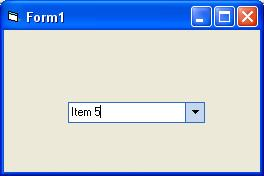



## jaFlatCombo

### Description

Yet another flat combobox (office 2003 style). This control uses vbAccelerator code for 'Office/VS.NET Style Flat Combo Boxes' but instead of the dependencies (SSubTmr.dll

), it uses Paul Caton's subclassing method. I'm taking no credit for this. All the credits for them :)
 
### More Info
 

             |
---                |---
**Submitted On**   |2005-06-01 05:07:22
**By**             |[Joaquim Aparicio](https://github.com/Planet-Source-Code/PSCIndex/blob/master/ByAuthor/joaquim-aparicio.md)
**Level**          |Intermediate
**User Rating**    |5.0 (25 globes from 5 users)
**Compatibility**  |VB 6\.0
**Category**       |[Custom Controls/ Forms/  Menus](https://github.com/Planet-Source-Code/PSCIndex/blob/master/ByCategory/custom-controls-forms-menus__1-4.md)
**World**          |[Visual Basic](https://github.com/Planet-Source-Code/PSCIndex/blob/master/ByWorld/visual-basic.md)
**Archive File**   |[jaFlatComb189545612005\.zip](https://github.com/Planet-Source-Code/joaquim-aparicio-jaflatcombo__1-60845/archive/master.zip)

